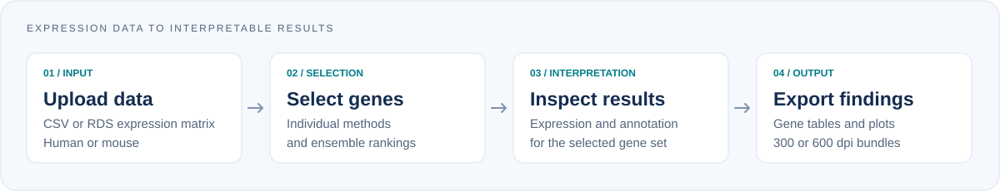
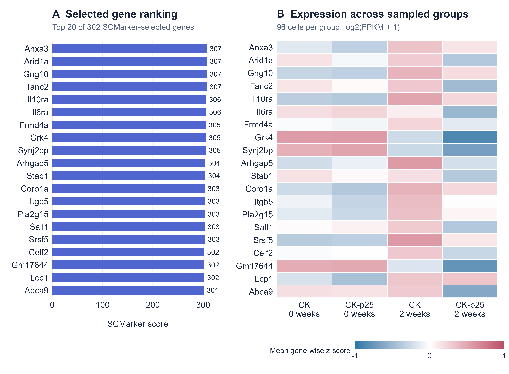

# scGenesFinder

Gene selection and interpretation for single-cell RNA sequencing data.

[](https://github.com/PaplomatasP/scGenesElite/actions/workflows/checks.yml)
[](LICENSE)

[Get started](#get-started) | [Case study](case-studies/ck-p25/README.md) | [User guide](docs/GETTING_STARTED.md) | [Development](docs/DEVELOPMENT.md)

scGenesFinder brings gene selection, expression inspection and functional annotation into an R Shiny application. Upload a labelled expression matrix, compare selection strategies and examine the returned genes through plots and downstream analyses. Human and mouse data are supported.



## From an expression matrix to a gene set

| Stage | What you can do |
| --- | --- |
| Upload | Read CSV or RDS data, check the preview and choose the organism and gene identifiers. |
| Select | Use differential expression, single-cell methods, classifier importance or SHAP values; combine rankings through ensemble selection. |
| Inspect | Explore gene scores and expression, classification outputs, enrichment results, KEGG maps and interaction graphs. |
| Export | Save selected data and plots, including download bundles with 300 or 600 dpi settings. |

## A reproducible example

The CK-p25 case study uses **384 microglial cells** from four mouse source samples in GSE103334. SCMarker returned **302 genes** from **1,860 mapped inputs**, an **83.8%** reduction. The figure connects the leading 20 scores to expression across the sampled conditions and time points.

[](case-studies/ck-p25/README.md)

The heatmap shows mean gene-wise standardized log2(FPKM + 1) expression. It was prepared from the saved analysis results. The example describes a mouse neurodegeneration dataset; it does not establish independently validated disease biomarkers. A separate KEGG audit found no terms with FDR < 0.05.

[Read the analysis and reproduce it](case-studies/ck-p25/README.md) | [Download the input](case-studies/ck-p25/input_ExampleData.csv) | [Vector figure](case-studies/ck-p25/figures/scGenesFinder_case_study.pdf)

## Get started

Clone the repository, then run the installer from the application directory:

```sh
git clone https://github.com/PaplomatasP/scGenesElite.git
cd scGenesElite/scgenes
Rscript Install_Packages/install_all.R
```

From an R session in that directory:

```r
shiny::runApp(".", host = "127.0.0.1", port = 3572, launch.browser = TRUE)
```

Use cells as rows, numeric gene-expression columns and labels in the final column. The sidebar accepts CSV or RDS files. See the [user guide](docs/GETTING_STARTED.md) for input examples, analysis settings and troubleshooting, or the [Docker instructions](docs/DEVELOPMENT.md#docker) for container setup.

## Documentation and reproducibility

| Resource | Contents |
| --- | --- |
| [User guide](docs/GETTING_STARTED.md) | Installation, input format and the analysis workflow |
| [CK-p25 case study](case-studies/ck-p25/README.md) | Data provenance, recorded parameters, scripts, results and 600 dpi figures |
| [Development guide](docs/DEVELOPMENT.md) | Source layout, regression checks and Docker setup |
| [Contributing](CONTRIBUTING.md) | Reporting a problem or proposing a code change |
| [Change history](CHANGELOG.md) | Application and analysis updates |

GitHub Actions runs six application regression scripts and checks the committed case-study results. The case study also includes an archived function snapshot, package versions and artifact checksums. Classification currently splits cells after gene selection; its metrics require this context when interpreting performance. See [analysis limits](docs/GETTING_STARTED.md#interpreting-results).

## Project and attribution

The application is named scGenesFinder; the repository retains its original name, scGenesElite. Its code is distributed under the [GNU AGPL v3 license](LICENSE). Study data and annotation resources retain their source attribution and applicable terms, documented with the [case study](case-studies/ck-p25/README.md#data-provenance).

When reporting an analysis, record the repository URL and commit, selection settings, source dataset and package versions. [Open an issue](https://github.com/PaplomatasP/scGenesElite/issues/new/choose) for questions or reproducible problems.
