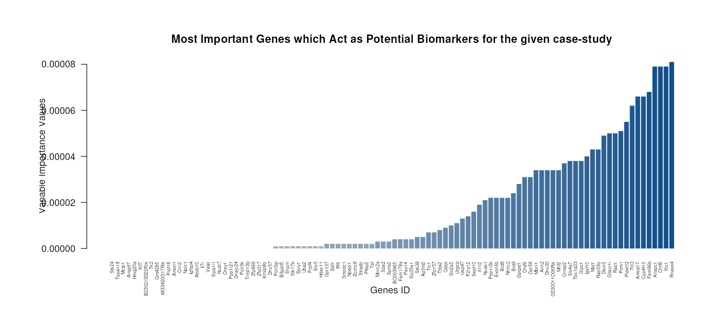
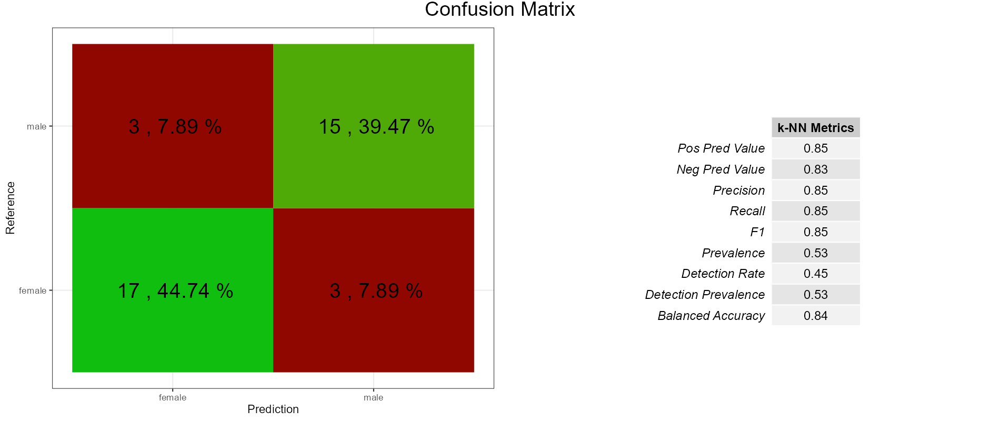
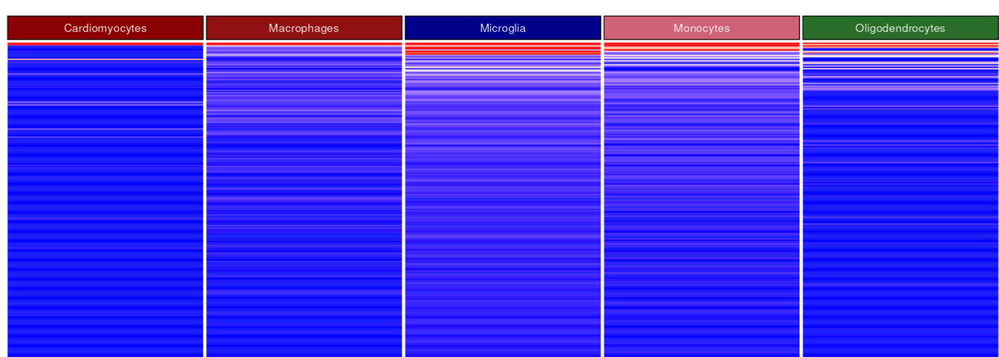
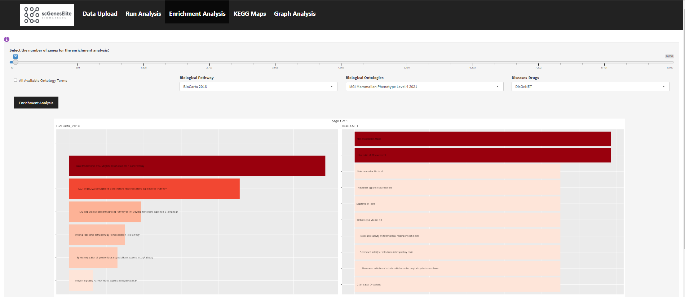
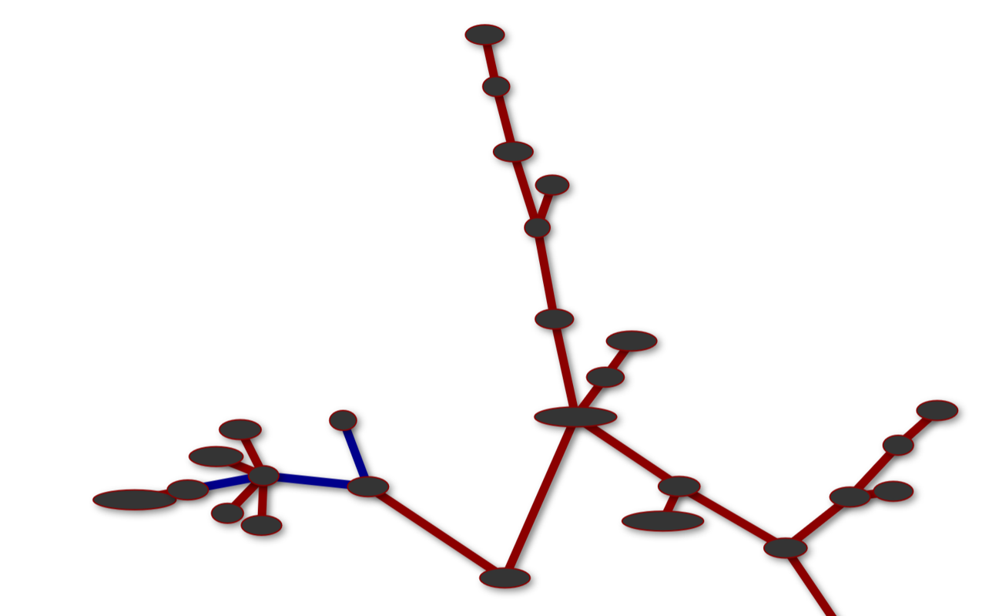

# scGenesElite

- [Shiny app for exploration of single Cell data](#shiny-app-for-identification-of-single-cell-biomarkers)
  - [Introduction](#introduction)
  - [Data upload](#data-upload)
  - [Feature selection](#feature-selection)
  - [Enrichment analysis](#enrichment-analysis)
  - [KEGG maps](#kegg-maps)
  - [Graph analysis](#graph-analysis)

This is a web-based R/shiny application designed for processing and feature selection of scRNA-seq data. It offers a range of reliable and advanced feature selection algorithms, along with frequently used visualization tools, making it a comprehensive platform. scGenesElite simplifies the handling of single-cell data, providing researchers with a user-friendly and intuitive interface.

## Running the app

Simply click the [link](http://212.227.75.194:8447/).

### Introduction

The app serves as a versatile platform for identifying disease biomarkers by identifying dominant genes. It employs three established gene selection method categories that utilize statistical, machine learning, and cutting-edge feature selection techniques specifically designed for scRNA-seq data. With 20 different feature selection modes available, users have a wide range of options. The gene list generated by the app can be analyzed further using the EnrichR tool, allowing users to examine enrichment in various biological and pharmacological features such as pathway terms, gene ontology (GO) terms, disease terms, and drug substances. Moreover, users can export snapshots of KEGG pathway maps that highlight the exported genes and biomarkers in png format.

### Data upload

In this tab, users can upload the data that they wish to analyze. Datasets can be uploaded in either .rds or .csv formats. Users can also specify the type of separator, the type of quote as well as whether they want either the head (first few lines) or the whole dataset to be displayed once it has been uploaded. Do note that it is extremely important that users specify the correct data corresponding organism (human or mouse).

### Feature selection

In the "Run Analysis" tab, users can perform feature selection on the dataset that has been uploaded through the previous tab. They can choose from a wide selection of well established feature selection methods. Two data filtering methods can also be utilized to preprocess the data for further analysis; Users can either remove features with low variance or keep features with a high degree of variability (both thresholds can be specified by users). Data normalization is also an option.
Through the "Number of genes" slider, users can specify the number of selected features to be displayed. The variable gene feature selection methods can be seen in the following photo:

The rest of the feature selection algorithms available for use within the app can be seen in the photos below:

|         p-value based         |      Machine learning based      |
| :---------------------------: | :------------------------------: |
|  |  |

|         Tree-based ml         |      Machine learning based      |
| :---------------------------: | :------------------------------: |
|  |  |

Users also have the option of selecting many different feature selection algorithms in order to create an ensemble.

Results are visualized through a bar plot as well as a confusion matrix. The bar plot shows the importance of each selected gene/feature. The confusion matrix displays the performance of a knn classifier on the filtered version of the dataset.

|             Bar plot             |          Confusion matrix          |
| :------------------------------: | :--------------------------------: |
|  |  |

Users can also display the results through a heatmap. The heatmap specifically uses cell type or State labeling to organize and display the data.

### Enrichment analysis

In this tab, users can check the genes that were highlighted through the analysis in the previous tab. They can choose to look at all the genes or just some of them, like the top 50 highest scoring genes. Users can also select from 18 different Pathway Datasets that are grouped into three categories: Biological Pathways, Biological Ontologies, and Diseases-Drugs.

They can choose to analyze one specific pathway, a combination of three ontology terms, or all available ontology terms. This analysis is done using the Enrichr database, which helps users understand the biological significance of their gene sets.

|   Biological pathways    |   Biological ontologies   |            Diseases-drugs |
| :----------------------: | :-----------------------: | ------------------------: |
|  |  |  |

### KEGG maps

In this tab, users can look at KEGG Pathway Maps which show the important parts and functions of the biological system being studied. They can choose the pathway they are interested in by copying and pasting the pathway identifier into the visualization tool after clicking the "go" button.

Please do note that it's important to select the right organism before using this feature because KEGG Pathway Maps are specific to particular organisms. The following is an example of a KEGG map.

### Graph analysis

In this tab users can analyze protein-protein interactions (PPI) and similarity graphs.

With PPI analysis, users can choose a threshold to include only interactions with a high enough score, based on the STRINGdb database.

Similarity graph analysis helps users find molecular modules by comparing gene interaction profiles.

Users can adjust the level of similarity by setting a Pearson correlation threshold.
