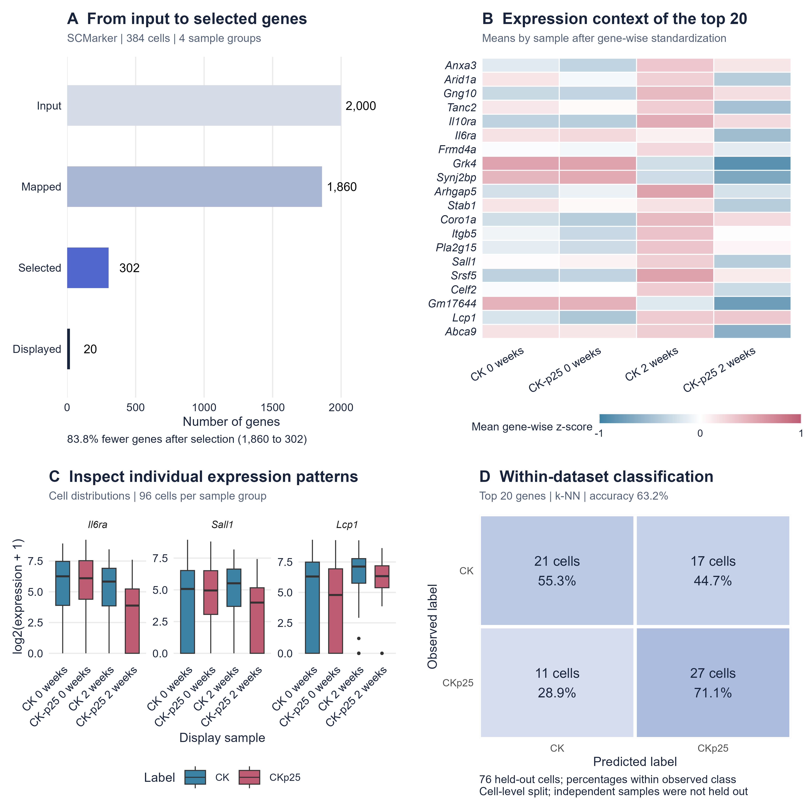

# CK-p25 microglia: SCMarker selection and expression inspection

This example runs the mouse annotation and SCMarker functions used by scGenesFinder on a defined subset of GSE103334. The input describes mouse neurodegeneration with Alzheimer-like pathology. It is not a human Alzheimer cohort.

## Data provenance

The source study is Mathys et al., *Temporal Tracking of Microglia Activation in Neurodegeneration at Single-Cell Resolution*, Cell Reports 21 (2017), 366-380. [DOI: 10.1016/j.celrep.2017.09.039](https://doi.org/10.1016/j.celrep.2017.09.039).

- [GEO record GSE103334](https://www.ncbi.nlm.nih.gov/geo/query/acc.cgi?acc=GSE103334)
- [Public FPKM matrix](https://ftp.ncbi.nlm.nih.gov/geo/series/GSE103nnn/GSE103334/suppl/GSE103334_FPKM_CKP25_TOPHAT.txt.gz)
- Input: `input_ExampleData.csv`, SHA256 `3E8459A5C9E6A91A4D2BA5E2965532DACF5734392BB64306DCCCC03BB5C29CA9`.

The supplied subset contains 384 cells and 2,000 genes, plus the final `Labels` column. It differs from the older example under `scgenes/data/`. Its 768,000 expression values were matched to the public matrix within a maximum absolute difference below 1e-12. Source gene names were matched with `make.names(..., unique = TRUE)`; no expression values were corrected. The mechanism that originally chose these 2,000 genes is not recorded, so this is an analysis of a preselected example rather than the full experiment.

| Source sample | Cells | Label | Time |
| --- | ---: | --- | --- |
| CK_0w_m1 | 96 | CK | 0 weeks |
| CKp25_0w_m1 | 96 | CKp25 | 0 weeks |
| CK_2w_m2 | 96 | CK | 2 weeks |
| CKp25_2w_m2 | 96 | CKp25 | 2 weeks |

The 0-week samples precede p25 induction. Each condition and time point has one source sample in this subset. Cells are not independent biological replicates.

## Reproduce the analysis

Run all commands from the repository root, after installing application dependencies. `code_snapshot/` preserves the functions used for the recorded run; it is deliberately independent of later application edits.

```sh
Rscript case-studies/ck-p25/verify_results.R
Rscript case-studies/ck-p25/check_provenance.R
Rscript case-studies/ck-p25/run_selection.R
Rscript case-studies/ck-p25/run_enrichment.R
Rscript case-studies/ck-p25/make_figure.R
```

`verify_results.R` checks the committed results without changing them. `check_provenance.R` downloads the public source matrix into an ignored cache, or accepts a local source path as its first argument; it requires `data.table` and `R.utils`. The selection and enrichment commands overwrite the saved results in this directory. Figure generation requires `ggplot2`, `gridExtra` and `ragg`, a Cairo-capable R build and the Arial font for the recorded typography. Other font substitutions may change layout.

The run used R 4.6.1, SCMarker 2.0 and EnsDb.Mmusculus.v79. See `sessionInfo.txt` for loaded package versions. The supplied FPKM matrix was not renormalized and no optional variance filter was applied. Annotation retained 1,860 genes and excluded 140 names, listed in `unmapped_input_genes.csv`. For mapped columns, values were unchanged.

SCMarker settings were `geneK=10`, `cellK=10`, `cutoff=2`, `width=1`, followed by marker selection with `k=150` and `n=20`. The script sets seed 20260906 before running the all-cell analysis and then the week-2 analysis. Cell labels are retained as metadata and are not used by SCMarker for selection.

## Current publication figure



The four panels use the same plotting and export functions as the application's **Publication figures** workspace. SCMarker returned 302 genes from 1,860 mapped inputs. Expression panels show the leading 20 genes and the distributions of Il6ra, Sall1 and Lcp1. The k-NN evaluation correctly classifies 48 of 76 held-out cells (63.2%). Selection precedes the cell-level split; cells from the same source sample may occur in both partitions. This does not measure prediction in independent animals.

Download the [vector PDF](figures/scGenesFinder_results_collage.pdf), [600 dpi PNG](figures/scGenesFinder_results_collage_600dpi.png), or [complete publication bundle](scGenesFinder_app_publication_bundle.zip). The bundle includes individual panels, plotted values, predictions, split identifiers and methods notes. Use [publication_metadata.csv](publication_metadata.csv) to group cells by source sample in the application; see the [publication guide](../../docs/PUBLICATION_FIGURES.md).

To reproduce this figure from the repository root, run `Rscript --vanilla case-studies/ck-p25/export_publication_figure.R`. The script checks the heatmap values against the recorded expression table and the confusion counts against the archived classifier output before writing the figure and bundle. It records the current package environment in `publication_sessionInfo.txt`. Classification uses the leading 20 selected genes and seed 20260908.

## Recorded selection results and earlier figure

The all-cell run returned 302 genes from 1,860 mapped inputs, an 83.8% reduction. Anxa3, Arid1a, Gng10 and Tanc2 each had a reported score of 307. Scores define the returned ranking and are not fold changes, p-values or associations with disease labels. Ties retain the implementation's returned order.

The week-2-only run returned 374 genes from 192 cells. Seven genes were shared between its leading 50 and the leading 50 from the all-cell run. This comparison changes both the time-point composition and the number of cells; it does not isolate either factor or estimate biological reproducibility.


Panel A shows the first 20 returned genes. Panel B transforms expression with log2(FPKM + 1), standardizes each gene across all 384 cells and averages the standardized values within each source sample. At 2 weeks, mean Il6ra values were 0.09 for CK and -0.51 for CKp25; Sall1 values were 0.29 and -0.39. Lcp1 values were 0.32 and 0.33. These are descriptive sample means. Differential expression and independent biomarker validation were not established.

The figure is an analysis-derived plot, not an application screenshot. Exports are available as [vector PDF](figures/scGenesFinder_case_study.pdf), [600 dpi PNG](figures/scGenesFinder_case_study_600dpi.png) and [600 dpi TIFF](figures/scGenesFinder_case_study_600dpi.tiff), at 170 x 125 mm.

## Pathway audit

`KEGG_2019_Mouse.gmt` archives the 303-term [Enrichr library](https://maayanlab.cloud/Enrichr/geneSetLibrary?mode=text&libraryName=KEGG_2019_Mouse) downloaded on 2026-09-06. Each run's leading 20, 50 and 100 genes were tested against the 1,860 mapped input genes with one-sided hypergeometric tests. Benjamini-Hochberg correction was applied across all 303 terms within each of the six analyses. Symbols were uppercased for matching.

The parser excludes the final tab-only record in the downloaded GMT before testing or multiple-testing correction. No term had FDR < 0.05. This audit uses a dataset-specific background and is separate from the application's default Enrichr query. No KEGG pathway map is presented as a positive result.

Enrichr reference: Kuleshov et al. (2016), [10.1093/nar/gkw377](https://doi.org/10.1093/nar/gkw377). Multiple-testing procedure: Benjamini and Hochberg (1995), [10.1111/j.2517-6161.1995.tb02031.x](https://doi.org/10.1111/j.2517-6161.1995.tb02031.x).

## Files and scope

CSV files contain cell metadata, rankings, excluded names, plotted values and all pathway test results. The two RDS files preserve mapped input, selection output and metadata for both runs. `SHA256SUMS.csv` records relative-path checksums for the distributed artifacts. The archived GMT and GEO-derived values retain their respective source attribution; the application's code license does not replace source-data terms.

The example demonstrates gene selection, expression inspection and within-dataset classification with a supplied dataset. It provides no measured speed comparison, comparative classification benchmark or validation in independent animals. The manuscript draft is not included in this public repository.
